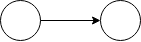

# グラフしんどい

## 2017-08-15 競プロ強化カリキュラムLT会

[@mt_caret](https://twitter.com/mt_caret)

---

# 概念の説明

---

# グラフとは？

頂点（Vertex）、辺（Edge）の組み合わせ
（厳密な定義ではない）

詳しくは東大資料第7章を参照

---

# 完全グラフ

全ての頂点同士が辺でつながっているようなグラフ

---

# トーナメントグラフ

完全グラフの有向版（全ての頂点同士がどちらかを向いた辺でつながっているような有向グラフ）

---

# ハミルトン路

あるグラフの全ての頂点を一度ずつ通るような路。
ハミルトン路の始点と終点が同じ場合はハミルトン閉路と呼ぶ。
あるグラフがハミルトン路を含むか判定するのは**NP完全**。

## オイラー路

ハミルトン路は全ての**頂点**を一度ずつ通る路な一方オイラー路は
全ての**辺**を一度ずつ通るような路を指す。

---

# AOJ 2386 Sightseeing Tourの概要

$N(1 \le N \le 100)$個の頂点からなる完全グラフの各辺を決めて
ハミルトン路を含むようなトーナメントグラフに変換する。
この時各辺の向きに応じてコスト$C_{i,j}(0 \le C_{i,j} \le 1000000)$が
与えられるので、コストの合計の最小値を求めよ。

---

# なんもわからん

解法は浮かんだものの、それが正しいのか分からず結局解けなかった。
解法自体はめちゃくちゃ簡単だった。

---

# 解法

トーナメントグラフは必ずハミルトン路を含むため、
コストが低い方の向きを選択し続けた合計が解となる。

---

## トーナメントグラフは必ずハミルトン路を含む

---

---

## 証明

1. $N \le 2$の時→自明

2. $N \le k$と仮定したとき

$k+1$個の頂点からトーナメントグラフを考える。適当に
頂点$v$を決め、残りの頂点を頂点$v$に向いた辺を持つ頂点の集合
$V_{in}$と頂点$v$から向いた辺を持つ頂点$V_{out}$にわける。この時、
$|V_{in}|, |V_{out}| \le k$なため仮定よりそれぞれハミルトン路を含む。
$V_{in}$のハミルトン路、$v$、$V_{out}$のハミルトン路をつなげると
$k+1$頂点のトーナメントグラフのハミルトン路を作れる。

数学的帰納法により証明。

https://math.stackexchange.com/questions/1682492/prove-that-every-tournament-contains-at-least-one-hamiltonian-path

---

# 教訓

- グラフ理論（離散数学全般も？）を少し勉強しておいて
  損はないかもしれない
- 「解が正しいかわからない時にとりあえず実装してみて
  ジャッジを通るかで試す」はしてはいけない
  （ACしたところで勉強にならないので意味がない）
- 人のブログ記事結構間違っている（漸化式だったり、
  ハミルトン路をオイラー路って書いちゃったり...）

